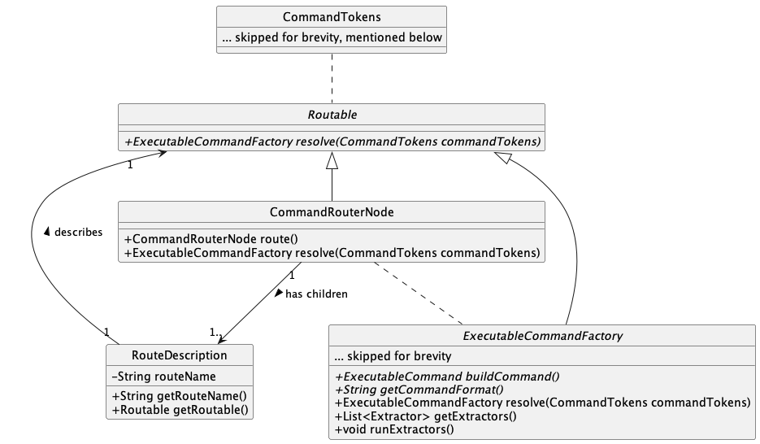
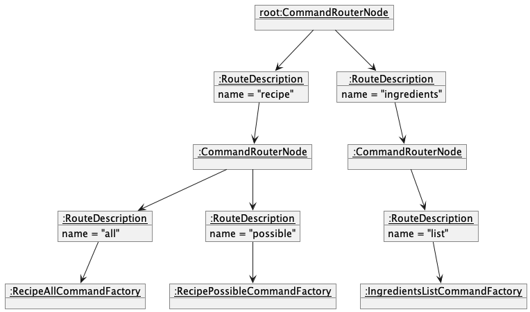
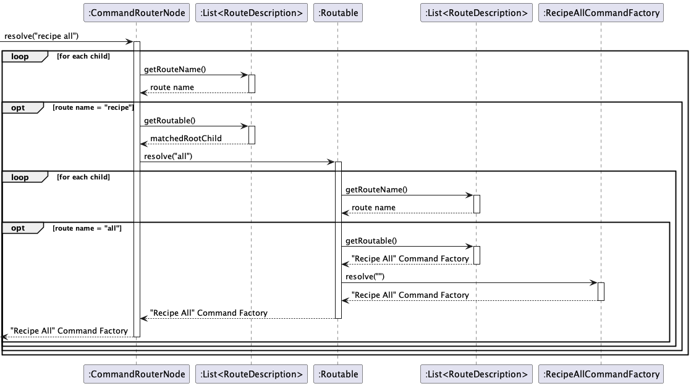
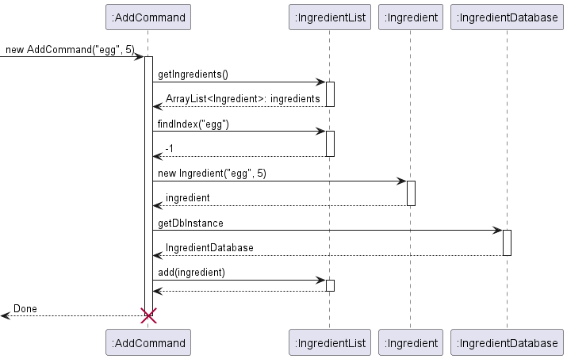
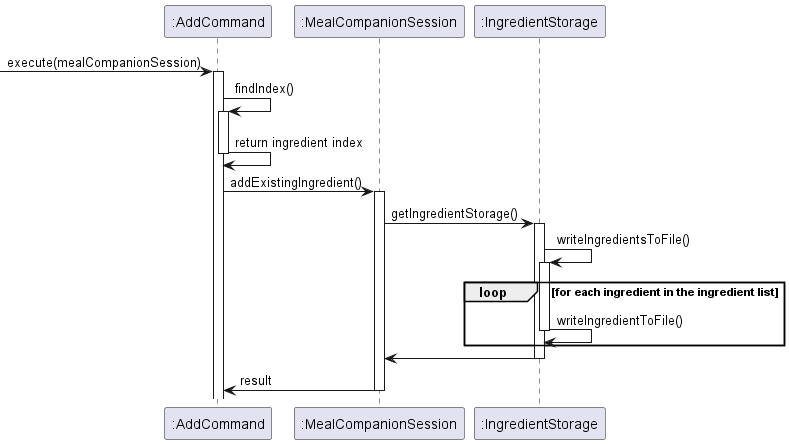

# Developer Guide
Welcome to the Meal Companion Developer Guide! Thank you for taking an interest in the behind-the-scenes working of our product, and we hope this document proves informative and useful for your work.

## Table of Contents
1. [Acknowledgements](#acknowledgements)
2. [Setting up, getting started](#setting-up-getting-started)
3. [Design](#design)
   - [Command Parsing](#command-parsing)
   - [Ingredient Class](#ingredient-class)
   - [Recipe Class](#recipe-class)
4. [Implementation](#implementation)
   - [Add and Remove Command](#add-and-remove-command)
   - [Recipe Detail Command](#recipe-detail-command)
   - [Recipe Possible Command](#recipe-possible-command)
   - [Recipe All Command](#recipe-all-command)
   - [Storage Feature](#storage-feature)
5. [Documentation, logging, testing, configuration, dev-ops](#documentation-logging-testing-configuration-dev-ops)
6. [Appendix: Requirements](#appendix-requirements)
   - [Product scope](#product-scope)
   - [User stories](#user-stories)
   - [Use cases](#use-cases)
   - [Non-Functional Requirements](#non-functional-requirements)
   - [Glossary](#glossary)
7. [Appendix: Instructions for manual testing](#appendix--instructions-for-manual-testing)

## Acknowledgements

{list here sources of all reused/adapted ideas, code, documentation, and third-party libraries -- include links to the original source as well}

###### [Back to table of contents](#table-of-contents)

## Setting up, getting started

1. Java 11 is required for Meal Companion to function properly, please make sure your device has Java 11 installed. If not, you may download it [here](https://www.oracle.com/sg/java/technologies/downloads/#java11). If you need further asssistance installing Java 11, you may refer to the [Installation Guide](https://docs.oracle.com/en/java/javase/11/install/installation-jdk-microsoft-windows-platforms.html).

2. Once you have ascertained that your device has Java 11 installed, you may download the `.jar file` [here](https://github.com/AY2223S2-CS2113T-T09-3/tp/releases/tag/v2.0). 

Click on `mealcompanion.jar` to automatically download the file. Place the file in a folder of your choice.

If you wish to view the source code, you may click on either `Source code (zip)` or `Source code (tar.gz)` to download the source code of Meal Companion for your perusal and testing. Unzip the folder and open the project using any Integrated Development Environment (IDE), although we recommend using IntelliJ Idea. You can download IntelliJ Idea [here](https://www.jetbrains.com/idea/download/#section=windows). Please ensure you download the right version for your respective operating system. 

3. Open the command terminal and navigate to the folder where you downloaded `mealcompanion.jar` using `cd <file path>` commands as necessary.
4. Ensure the terminal is within the correct folder.
5. Use the command `java -jar mealcompanion.jar` to launch Meal Companion.   

6. When you are finished using Meal Companion, use the `bye` command to terminate the application. This will ensure your stored data is saved correctly for future access.

Please be advised that we cannot guarantee complete functionality of Meal Companion if you have modified the source code in your own local IDE. If you have any queries, feel free to reach out to any member of the development team and we will do our best to assist you.

###### [Back to table of contents](#table-of-contents)

## Design

### Command Parsing

The system of `Routable` classes is built to allow for a composable setup of commands and subcommands.

Developers are able to build a "routing tree" by nesting `CommandRouterNode`s together, allowing for command matching
to be done in a robust and extensible way. This architecture was chosen because our commands are designed to have common
prefixes, such as the "recipe all" and "recipe possible" commands.

Therefore, we need to standardize the way we parse
the command in such a way that we do not have to worry about match priority or ordering, as we would if we
were to implement this with simple if-else or switch statements.

- The "routing tree" is built around the concept of the `Routable` interface, with a `CommandRouterNode` at the root.
- Classes which implement `Routable` have a `resolve` function which will map a `CommandTokens` object to an
`ExecutableCommandFactory`.
- Routing is done in a depth-first fashion via recursive calls to `resolve`, until an
endpoint is reached at which point the corresponding `ExecutableCommandFactory` is returned.

This is an object diagram representing a portion of the routing tree for MealCompanion, supporting the "recipe all",
"recipe possible", and "ingredient list" commands.

The sequence diagram below illustrates the process for resolving the "recipe all" command.

### Ingredient Class

Below shows the class diagram of how ingredients are being stored in our program

The current `MealCompanionSession` would keep track of the `IngredientList` which is an ArrayList of `Ingredient` objects. Each `Ingredient` object has a name and its associated quantity. This association would allow us to perform the adding and removal of ingredients by the user.

### Recipe Class

Below shows the class diagram of how recipes are being stored in our program

The current `MealCompanionSession` would keep track of the `RecipeList` which is an ArrayList of `Recipe` objects.

## Implementation

### Add and Remove Command

The add and remove command is facilitated by the methods in `IngredientList` and `Ingredient`. Given below is an example usage scenario and how the add and remove command behaves.

Step 1. The user inputs his command e.g. `add egg /qty 5`, `IngredientList` would be called to check if egg is already stored inside the list

Step 2. Suppose egg is not currently stored in `IngredientList`,  the name of the ingredient 'egg' would be crosschecked with our database of known ingredients

Step 3. Since egg is part of our list of known ingredients, a new `Ingredient` object would be created with the quantity, 5, and name, egg, specified by the user and added to `IngredientList` with the `add()` method.

Below shows the sequence diagram for the above AddCommand:

Continuing from the above AddCommand:

Step 4. Now the user decides to remove 2 eggs and inputs his command e.g. `remove egg /qty 2`, the `IngredientList` would be searched through to see if egg is in the list

Step 5. Since egg is in the list, its corresponding index in the list would be generated. 

Step 6. The current quantity of egg in the list would be obtained by calling `getQuantity()` and checked to see if it is greater or equals to '2' the quantity input by the user

Step 7. Since the quantity input by the user is smaller than the current quantity of egg, which is 3, in the `IngredientList`, the new quantity would be calculated to be 3 and updated by calling `setQuantity(3)` 

Below shows the sequence diagram for the above RemoveCommand:

###### [Back to table of contents](#table-of-contents)

### Storage Feature

The proposed storage mechanism of ingredients is facilitated by `IngredientStorage`. 

It requires `IngredientList` of `MealCompanionSession`.

This features saves ingredient list data in json format and reads them back into ingredient objects.

The following sequence diagram shows how data storage works:

###### [Back to table of contents](#table-of-contents)

### Recipe Detail Command

The recipe command is facilitated by `RecipeDetailCommand`. 

It requires `RecipeList` of `MealCompanionSession`. 

The recipe commands takes in either a recipe index or a recipe name as parameter. The latter is resolved into the recipe's corresponding index number.

The `Recipe` is retrieved from `RecipeList` and its details are outputted.

The following sequence diagram shows how the Recipe Detail Command works:

###### [Back to table of contents](#table-of-contents)

### Recipe Possible Command

The recipe possible command is facilitated by `RecipePossibleCommand`. 

It requires `RecipeList` and `IngredientList` of `MealCompanionSession`.

Given below is the only example usage scenario and how the recipe possible command behaves at each step.

Step 1: User wants to get a list of recipes that can be made with the current list of ingredients. User calls `recipe possible`.

Step 2: `RecipePossibleCommand` executes by retrieving the `RecipeList` and `IngredientList` of `MealCompanionSession`.

Step 3: Every `Recipe` in `RecipeList` is checked against all `Ingredient` in `IngredientList` to see if it can be made.

Step 4: `Recipe` that can be made are outputted.

The following sequence diagram shows how the Recipe Possible Command works:

###### [Back to table of contents](#table-of-contents)

### Recipe All Command

The recipe possible command is facilitated by `RecipeAllCommand`.

It requires `RecipeList` of `MealCompanionSession`.

Given below is the only example usage scenario and how the recipe possible command behaves at each step.

Step 1: User wants to get the full list of recipes stored in the program. User calls `recipe all`.

Step 2: `RecipeAllCommand` executes by retrieving the `RecipeList` of `MealCompanionSession`.

Step 3: Every `Recipe` in `RecipeList` is outputted.

The following sequence diagram shows how the Recipe All Command works:

###### [Back to table of contents](#table-of-contents)

## Documentation, logging, testing, configuration, dev-ops

{insert Documentation guide link}
{insert Testing guide link}
{insert Logging guide link}
{insert Configuration guide link}
{insert DevOps guide link}

## Appendix: Requirements

### Product scope

#### Target user profile
Our target user profile is the average School of Computing student that resides on campus, regardless of Residential College (RC), Halls, Residences or Houses. There is a focus on those who regularly cook in their hostels or would like to pick up cooking.

#### Value proposition
Our product targets students who would like to save money on buying or ordering food, and also to save time by preparing their meals beforehand, so they can eat immediately after a class without having to queue for food or look for a seat in a crowded canteen on campus. Aside from RCs, hostels on campus do not provide meal plans, so our product addresses this by helping users pick up cooking and manage the ingredients they have in their hostel refrigerators. Even within RCs, the meal plans do not cover lunch, meaning students need to source their own lunch, which is a problem that our product also aims to alleviate.

###### [Back to table of contents](#table-of-contents)

### User Stories

#### v1.0

| As a ... | I want to ... | So that ... |
| -------- | ------------- | ----------- |
| User | see the list of items in the fridge | I can know what is/is not in my fridge |
| User | add an item of a specified quantity | I can put new items into my fridge |
| User | remove an item of a specified quantity | I can know which items I have already used |
| User | find recipes I can make with my current ingredients | I can cook without having to go shopping |
| User | see the list of recipes available | I can know which recipes are registered within the app |
| User | have a default list of recipes initialized at the start | I can at least prepare some default dishes without knowing any recipes |
| New User | immediately see how to interact with the app | I can begin using the app without needing to refer to external help |
| User with a new device | transfer the saved customized data to a new computer | I can use Meal Companion on a different computer without having to re-enter all the information |

#### v2.0

| As a ... | I want to ... | So that ... |
| -------- | ------------- | ----------- |
| User with allergies | add my allergens to the app | I can avoid ingredients that I am allergic to |
| User with allergies | block recipes that include allergens | I can avoid a medical emergency because of not realizing the recipe included allergens |
| User | add recipes to a favourite section | I can easily see recipes that I like |
| User who wants to lose weight | see the calorie count of the recipes | I can keep track of my caloric intake |
| User who gets bored of the same recipe | randomly select a recipe | I can try new recipes from the list of existing recipes |
| User returning after a long period of not using the app | quickly clear all ingredients from the saved list | I can return to using the app without having to individually delete items that I no longer have |

###### [Back to table of contents](#table-of-contents)

### Use Cases

**Use Case #1: Make a Recipe**  
**MSS**
1. User requests to list possible recipes to make
2. MealCompanion shows list of possible recipes using the current ingredients list of the user
3. User requests to make a specific recipe from the list
4. MealCompanion makes this recipe and removes all relevant ingredients from the ingredients list
  
   Use case ends.

**Extensions**  
* 2a. The list is empty. 
    
  Use case ends.
     
* 3a. The given index is invalid.
  * MealCompanion shows an error message.
    
  Use case resumes at step 2.

**Use Case #2: See Missing Ingredients for Recipe:**
**MSS**
1. User requests to list all recipes
2. MealCompanion shows list of all recipes
3. User requests to see missing ingredients of a specific recipe from the list
4. MealCompanion shows list of ingredients in the recipe that are not in the ingredients list
     
   Use case ends.

**Extensions**  
* 3a. The given index is invalid.
   * MealCompanion shows an error message.
       
     Use case resumes at step 2.

###### [Back to table of contents](#table-of-contents)

## Non-Functional Requirements

{Give non-functional requirements}

1. Should work on any mainstream OS as long as it has Java 11 or above installed.
2. Should respond to a command within a second.
3. A user with above average typing speed for regular English text (i.e. not code, not system admin commands) should be able to accomplish most of the tasks faster using commands than using the mouse.
4. A user should be able to predict what the commands do by their names.

###### [Back to table of contents](#table-of-contents)

## Glossary

* *glossary item* - Definition

###### [Back to table of contents](#table-of-contents)

## Appendix: Instructions for manual testing

{Give instructions on how to do a manual product testing e.g., how to load sample data to be used for testing}

### Launch and Shutdown

### Saving Data

###### [Back to the top](#developer-guide)
